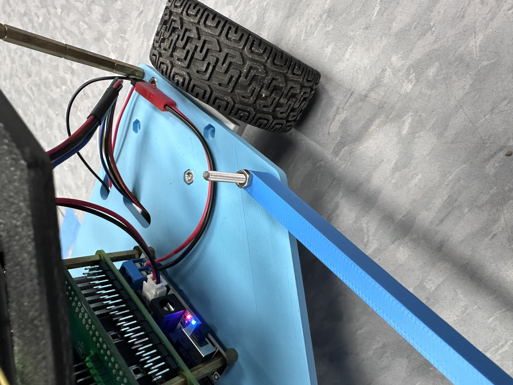
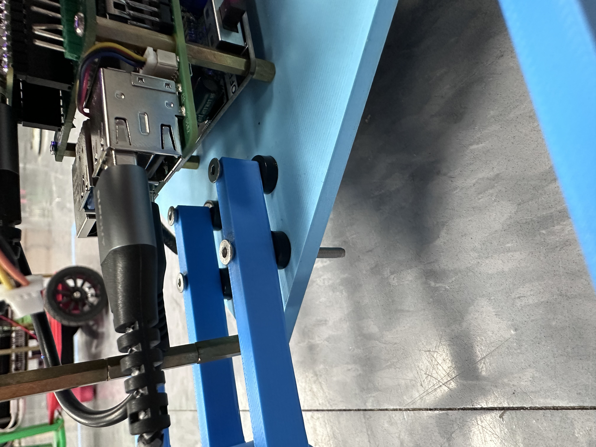
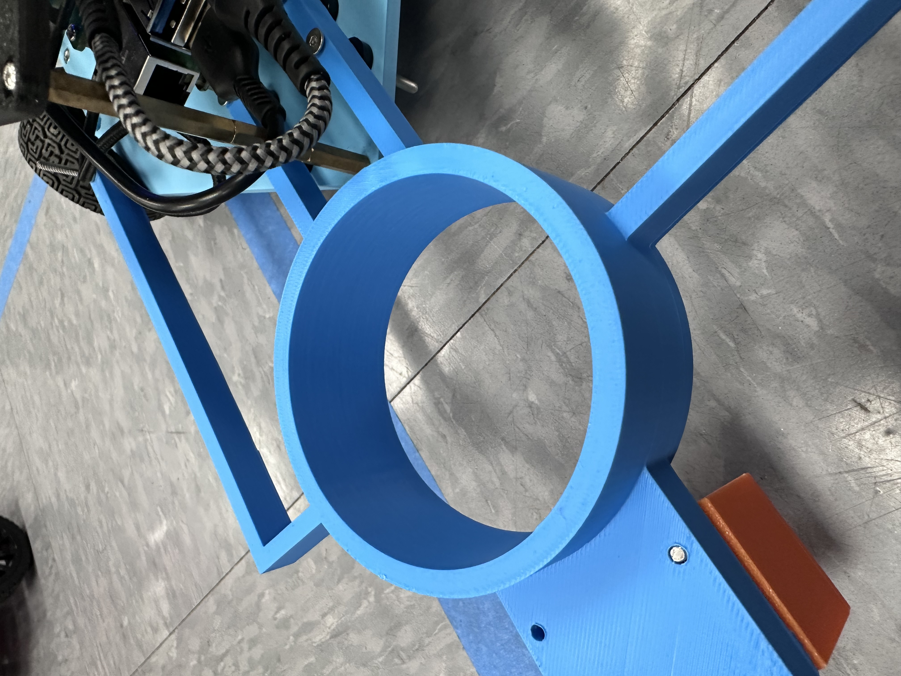
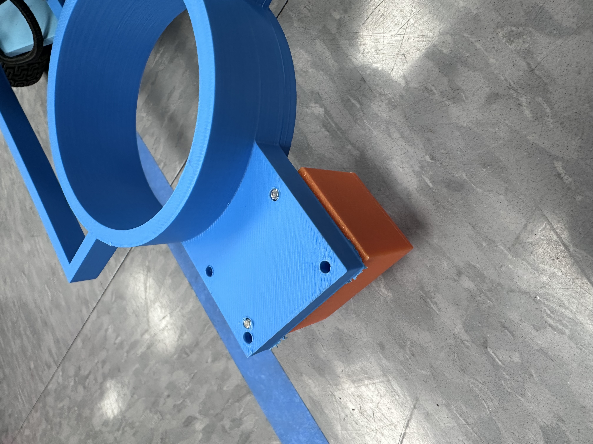

[](https://classroom.github.com/a/7KaPTW5f)
# The Odyssey

## Coffee Transportation Solution


Coffee Trailer Tech Draw


Custom Caster Wheel Tech Draw



Long arm connection to homer base, symetrical to the one on the other side.



Short arm connections to homer base, screws go through the arms and the base where the caster wheel originally was connected.



The coffee cup holder, connected to each arm to hold the coffee cup behind the bot.


The extrusion from the coffee holder, which allows the caster wheel to be connected to the coffee trailer using screws.

### Mechanical Design

### Hardware Installation Guide

The trailer used to carry the coffee cup is a 3D printed model that uses the dimensions shown in the above image under the Coffee Transport Solution section. This 3D printed trailer contains 4 arms, which have in total 6 locations at which screws can be used to attach the trailer to the homer base. Each of these arms connect to the coffee cup holder, which is comprised of a 70 mm circle that the coffee cup can fit into. Connected to the coffee cup holder, a piece extrudes with holes to screw in a caster wheel, which replaces the original location of the caster wheel from the original homer setup.

To install the coffee trailer, first ensure that the caster wheel from the original homer setup is removed, and that the raspberry pi and everything above it are out of the way so that the holes are accessible. Then, lining up the holes in the coffee trailer with the holes in the homer base, you can screw them together using M3 screws. Be sure to apply spacers between the screws and the base on the middle arms. Furthermore, the trailer is a tight fit, so alternating arms when screwing the trailer on is necessary to allow it to fit correctly. 

Once the trailer is attached, the caster wheel can be attached to the extruded piece that comes off of the coffee cup holder. Be aware that the holes for this are smaller than the M3 screws, and that the holes do not line up very well with the caster wheel used for the homer base. Some changes to the caster wheel base or to the coffee trailer extrusion would need to be made to make them fit, but to save time we simply drilled holes in the extrusion to make the caster wheel fit.

## Software Usage Instructions

### Setting up the Raspberry Pi:

Install Dependencies:
```
sudo apt update
sudo apt install ros-$ROS_DISTRO-slam-toolbox ros-$ROS_DISTRO-navigation2 ros-$ROS_DISTRO-nav2-bringup
sudo apt install ros-$ROS_DISTRO-tf-transformations
```

Building workspace:
```
mkdir -p ~/homer_ws/src
cd ~/homer_ws/src
git clone https://github.com/UCAEngineeringPhysics/p3-odyssey-wall-e/tree/main
cd ~/homer_ws
rosdep install -y --from-paths src --ignore-src --rosdistro $ROS_DISTRO
colcon build
source ~/homer_ws/install/local_setup.bash
echo "source ~/homer_ws/install/local_setup.bash" >> ~/.bashrc
```

Run Launch File:
```
ros2 launch homer_bringup homer_launch.py
```

### Setting up server:

Install Dependencies:
```
sudo apt update
sudo apt install ros-$ROS_DISTRO-slam-toolbox ros-$ROS_DISTRO-navigation2 ros-$ROS_DISTRO-nav2-bringup
```


Building workspace:
```
mkdir -p ~/homer_ws/src
cd ~/homer_ws/src
git clone https://github.com/UCAEngineeringPhysics/p3-odyssey-wall-e/tree/main
cd ~/homer_ws
colcon build
echo "source ~/homer_ws/install/local_setup.bash" >> ~/.bashrc
source ~/.bashrc
```

Run Launch File:
```
ros2 launch p3 auto.navigation.py
```


## Homer Derviations

The Pico in this project uses the C++ HAL dervied, Ros2 to Pico Drivetrain that can be found here: https://github.com/Melfely/PicoRos2Drivetrain.git

The Interface uses https://github.com/linzhangUCA/homer_bringup.git which is the standard homer build, but uses the PR#1 version, that has not been merged yet,
which has zero effect on the live drivetrain capabalities, which mostly assists in development, since the Pico board being reflashed does not crash the interface. 
