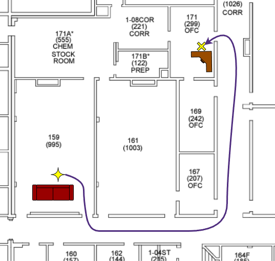

# Final Project: The Odyssey
> [!IMPORTANT]
> # Due: Friday, May 1st @ 12 PM

## Overview
In this project, your robot is expected to autonomously navigate the Lewis Science Center, traveling from Room 159 (Dr. Chen's lab) to Room 171 (PAE Department office). 
To demonstrate that the navigation is successful, your robot must complete a physical payload task: delivering a cup of coffee to the front desk in Room 171.

- The starting point, destination, and floor plan for the area of interest are illustrated in the diagram below.

- The coffee will be held in a standard 12 oz cup. Please refer to the dimensions below for your mechanical design.

Through this project, you will gain practical, hands-on experience with:
- Task-oriented design: engineering a mechanical solution to safely transport a liquid payload.
- The nitty-gritty of autonomous navigation: specifically, the usage, tuning, and configuration of slam_toolbox and Nav2.
- Distributed operations: managing multiple ROS 2 nodes communicating across multiple devices.

## Get Started Resources
Feel free to use the HomeR software suite as the infrustructure of the project.
- Motion control on the microcontroller: [`homer_pico`](https://github.com/linzhangUCA/homer_pico)
- Motion control interface on the Raspberry Pi: [`homer_bringup`](https://github.com/linzhangUCA/homer_bringup)
- SLAM and navigation on the server computer: [`homer_navigation`](https://github.com/linzhangUCA/homer_navigation)
- For more detailed guides, please refer to the HomeR's [documentation](https://linzhanguca.github.io/homer_docs/).

> [!TIP]
> You will work with a highly integrated system, any tiny changes could fail the entire system.
> - **Don't wait** until the last minute.
> - **Practice** ahead as many times as possible.
> - Check your wire connections and battery health **regularly**. 
> - Do simple **unit tests** if something was wrong. 
> - **Take notes** for things you cannot memorize.

## Requirements

### 1. (20%) Coffee Delivery Solutions
- Introduce mechanical designs of your team's coffee delivery solution.
  - Illustrate layout of key components. 
  - Upload sketches or techdraws with critical dimensions, and display them in [README](README.md).
- Provide an installation guide in [README](README.md).

> [!NOTE]
> **Bonus**:
> - (5%) Reasonable graphical installation guide.

### 2. (15%) Software Usage Instructions
Assume a user is going to deploy the ROS 2 packages related to this project on a Raspberry Pi and a server computer (both with newly installed ROS 2 Jazzy, so, no HomeR packages, no `slam_toolbox`, no Nav2).
Please provide instructions for the following steps.
- (3%) Installing and setting up dependent ROS 2 packages on the Raspberry Pi.
- (3%) Installing and setting up dependent ROS 2 packages on the server computer.
- (3%) Starting the map creation.
- (3%) Saving the map.
- (3%) Starting the autonomous navigation with the saved map.

> [!NOTE]
> **Bonus**:
> - (1%) Use CLI for map saving with functional commands.

### 3. (65%) Navigation Node
- (10%) Upload the map files for the project.
- (35%) Develop a functional ROS node (in a Python script)for navigating the robot to its destination.
- (10%) Configure the navigator with proper settings.
- (10%) Pack your ROS node(s) and configurations.
  Upload the package to the project repository.
  Indicate maintainer's name, email, package description, license information in proper files.
  Your package will be built on instructor's Raspberry Pi and server computer with freshly installed Ubuntu and ROS 2 Jazzy. 
- (Optional) Upload any software that is different from the HomeR collections. 

> [!NOTE]
> **Bonus**:
> - (10%) Use ROS 2's action service for navigation in the code.

### 4. (Bonus) 3-Minute Presentation
Please cover the following contents in your presentation.
1. (1%) Who you are and what are you going to present.
2. (2%) Project objectives and results.
3. (3%) Coffee and cup transportation solutions.
4. (4%) Navigation approaches.
5. (2%) Technical Q&As (**No questions, no bonus**).
   
### 5. (Bonus/Penalty) Demonstration
> [!IMPORTANT]
> #### Time: 11 AM - 1 PM on Thursday, Apr. 30th @ LSC159

#### Rules
- Each team has **3 attempts**.
- Each attempt will be limited to 5 minutes.
- Teams with fewer attempts have higher priority in the queue.
- Bonus/Penalty will be given based on the best attempt.
- Any human intervention will terminate attempt immediately.

#### Procedure
1. Place the robot on/behind the "Start Line".
2. Start all ROS nodes and let the robot do the job by itself.
3. Robot stops by itself and end the navigation with a visible indication.

#### Bonus/Penalty Points:
- +2% if the robot made it out of LSC159.
- +3% if the robor made it passing LSC167 (Dr. Mason's office). 
- +10% if the robot made it to the front desk of the department office.
- +5% if the robot dodged a dynamic obstabcle.
- +2% if the robot indicated the end of the navigation on the board.
- -5% if coffee spilled
- $-5\times d$% if the robot didn't get into the department office. $d$ is the euclidean distance from the robot's ending location to the closest point of the department door in meters.
  The maximum distance penalty will be 50% of the total project points. 

> [!TIP]
> Be expected to demonstrate the robot and answer the questions not only to the people from Annex 105, but also to anyone who may show up during the demo.
